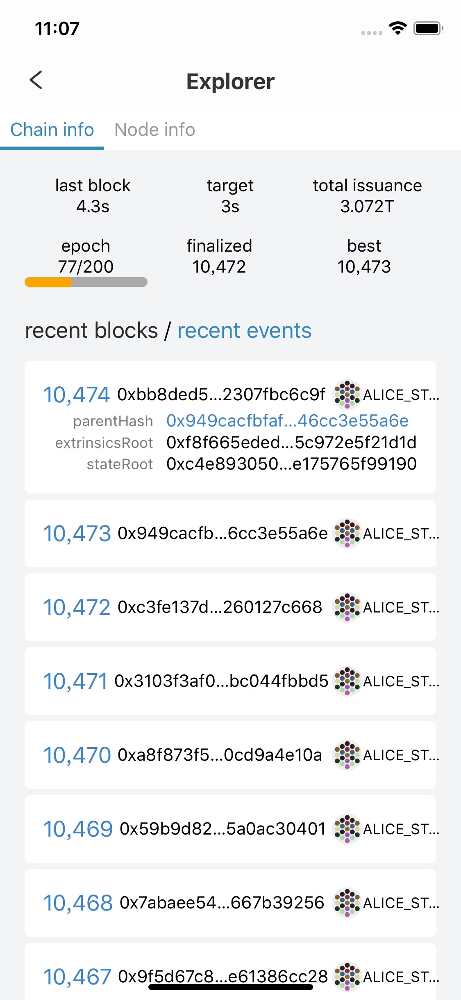
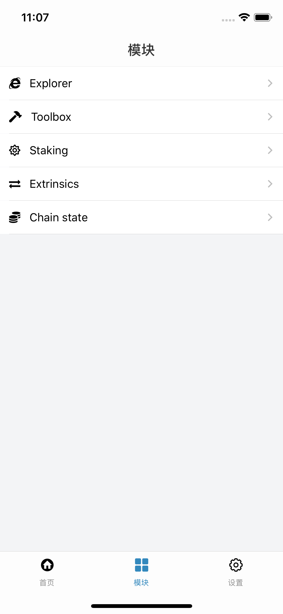
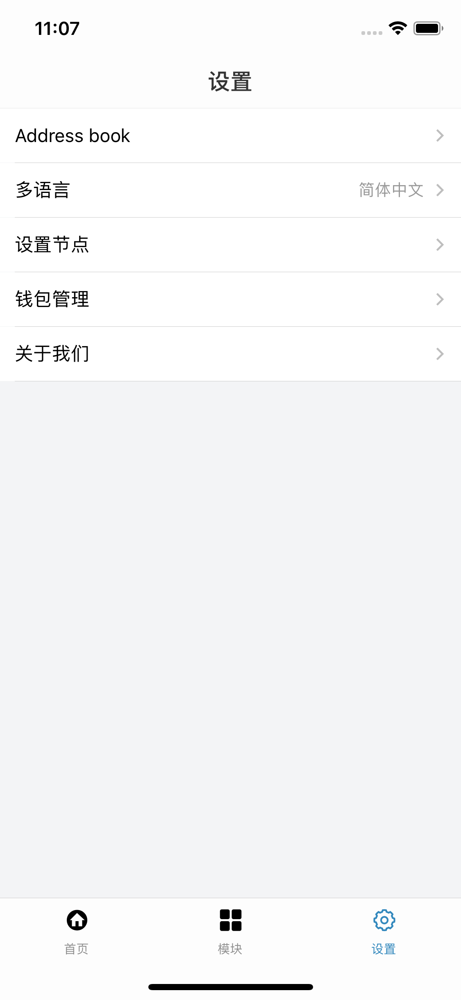
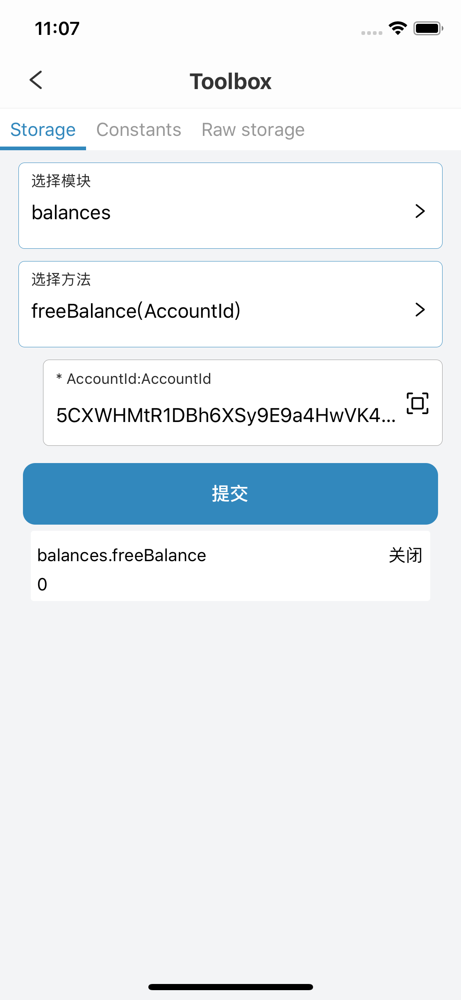

# substrate/polkadot 钱包 react-native实现
参考网页端开发    
[https://github.com/polkadot-js/apps](https://github.com/polkadot-js/apps)    
A Portal into the Polkadot and Substrate networks. Provides a view and interaction layer from a browser.

### 功能集合
- [x] 创建生成账号
- [x] 节点设置
- [x] 转账交易
- [x] explorer模块
- [x] Toolbox模块
- [x] Chain state模块

## Screenshots

<table>
  <tbody>
    <tr>
      <td align="center" valign="top">
        
      </td>
      <td align="center" valign="top">
        
      </td>
      <td align="center" valign="top">
        
      </td>
    </tr>
  </tbody>
  <tbody>
      <tr>
        <td align="center" valign="top">
          
        </td>
        <td align="center" valign="top">
          
        </td>
        <td align="center" valign="top">
          
        </td>
      </tr>
    </tbody>
    <tbody>
          <tr>
            <td align="center" valign="top">
              
            </td>
          </tr>
        </tbody>
</table>
